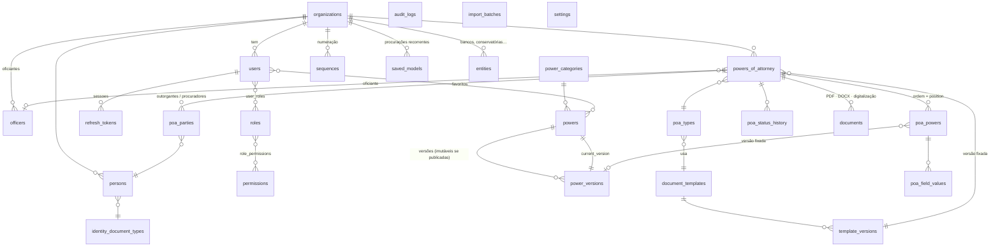

# Plataforma de Procurações — Arquitectura (Fase 1)

> Estado: **Fase 1** (núcleo, base de dados, API, documentos, segurança, auditoria) e **Fase 2** (frontend Next.js) concluídas e testadas. Ver §15–16.

## 0. Decisões tomadas antes de escrever código

| # | Decisão | Porquê |
|---|---|---|
| D1 | A procuração referencia **versões** de poderes e modelos, nunca o registo "vivo". | Requisito §34: alterar um poder não pode mudar documentos anteriores. |
| D2 | Campos e regras de um poder vivem **dentro da versão** (JSONB validado), não em tabelas soltas. | Texto, campos e regras têm de versionar juntos; senão uma alteração num campo muda retroactivamente o significado. |
| D3 | **Um único AST** do documento → HTML (pré-visualização e PDF) e DOCX. | O PDF é "exactamente" a pré-visualização (§19); DOCX coerente. |
| D4 | PDF via **Chromium headless** (Playwright), sem rede durante a renderização. | Qualidade tipográfica, paginação real, fidelidade com o ecrã. |
| D5 | Na emissão congela-se um **snapshot cifrado + SHA-256**; o PDF emitido nunca é regenerado. | Prova do que foi emitido; independente de mudanças futuras. |
| D6 | Integridade reforçada por **triggers PostgreSQL** (versões publicadas imutáveis, procuração emitida imutável, auditoria append-only). | Defesa em profundidade: nem um bug na API nem um SQL manual as alteram. |
| D7 | **Concordância de género/número** como capacidade do motor. | No corpus há erros como "sua bastante procurador". |
| D8 | N outorgantes e N procuradores desde o início. | 1,6% do corpus tem vários outorgantes; mudar depois é caro. |
| D9 | **Oficiante** (Vice-Cônsul, Cônsul-Geral…) é entidade própria. | Não estava na especificação, mas é parte essencial do acto consular. |
| D10 | **Drizzle ORM** em vez de Prisma. | Ver §1 — controlo SQL (triggers, `FOR UPDATE`, índices trigram), zero binários descarregados no build (importante em redes institucionais restritas). O modelo de entidades é o mesmo. |
| D11 | Dados pessoais sensíveis **cifrados na aplicação** (AES-256-GCM) com **índice cego** HMAC para pesquisa exacta. | Pesquisar por NIF/BI (§22) sem guardar os números em claro. |
| D12 | Segregação de funções: quem redige não valida (configurável). | Controlo interno; evita auto-validação. |
| D13 | IA **fora** do texto jurídico: sugestões só a partir de relações configuradas (REQUER/SUGERE). | §31 e §33: a IA não inventa poderes. |
| D14 | Templates executados por um **interpretador do AST** (sem `new Function`/eval), igual no servidor e no browser. | Descoberto na Fase 2: o Handlebars compila para JavaScript e a CSP estrita do frontend bloqueava-o. Em vez de enfraquecer a CSP com `unsafe-eval`, o motor deixou de avaliar código — mais seguro e com o mesmo resultado nos dois lados. |
| D15 | Frontend e API na **mesma origem** (`/api/v1` reencaminhado pelo Next.js). | O cookie de sessão `SameSite=Strict` funciona sem CORS; o access token fica só em memória. |
| D16 | O assistente grava o rascunho **automaticamente** (debounce ~0,7 s) com `lockVersion`. | "Voltar atrás sem perder informação" (§11) e protecção contra edição simultânea noutro posto. |
| D17 | Regras e texto em tempo real calculados no browser com o **mesmo pacote `@proc/core`**; a verificação oficial continua no servidor. | Feedback instantâneo sem duplicar lógica; o servidor revalida sempre antes de submeter, validar e emitir. |

Questões em aberto para decisão da entidade: ver §16.

## 1. Arquitectura da solução

```
┌────────────────────┐   HTTPS    ┌──────────────────────────────────────────────┐
│ Frontend (Fase 2)  │──────────▶│ API NestJS  /api/v1                           │
│ Next.js + TS       │  JWT curto │  Auth · RBAC · Throttling · Helmet · Zod      │
│ usa @proc/core p/  │  + cookie  │  ┌───────────┐ ┌───────────┐ ┌─────────────┐  │
│ pré-visualização   │  refresh   │  │ Poderes   │ │Procurações│ │ Emissão     │  │
│ instantânea        │            │  │ Importação│ │ Regras    │ │ PDF · DOCX  │  │
└────────────────────┘            │  └───────────┘ └───────────┘ └──────┬──────┘  │
                                  │  Auditoria (cadeia de hashes)        │         │
                                  └──────┬──────────────────────────────┼─────────┘
                                         │                              │
                           ┌─────────────▼─────────┐        ┌───────────▼──────────┐
                           │ PostgreSQL 16         │        │ S3 / MinIO (privado) │
                           │ triggers de integridade│        │ SSE, versionado      │
                           └───────────────────────┘        └──────────────────────┘
        @proc/core (TypeScript puro, sem I/O): extenso · concordância · validadores · campos ·
        templates seguros · regras · workflow · numeração · AST · render HTML · render DOCX
```

**Monorepo** (npm workspaces): `packages/core` (domínio puro, testável e reutilizável no browser), `apps/api` (NestJS), `apps/web` (Fase 2).

**Stack:** Node 22, TypeScript strict, NestJS 10, PostgreSQL 16 + Drizzle, Handlebars isolado (templates), Playwright/Chromium (PDF), `docx` (DOCX), argon2id, JWT HS256, S3/MinIO.

## 2. Diagrama das entidades



Correspondência com a lista pedida: `User, Role, Permission` ✔ · `Person` ✔ (Grantor/Attorney são **papéis** em `poa_parties`, evitando duplicar pessoas) · `Power, PowerCategory` ✔ · `PowerField, PowerRule, PowerDependency, PowerIncompatibility, PowerTemplate` → dentro de `power_versions` (D2) · `PowerOfAttorney, PowerOfAttorneyPower, PowerOfAttorneyFieldValue` ✔ · `DocumentTemplate, DocumentVersion` → `document_templates, template_versions` · `Document` ✔ · `AuditLog, Sequence, Organization, Setting` ✔.
Acrescentadas: `officers`, `identity_document_types`, `entities`, `poa_status_history`, `refresh_tokens`, `user_favorite_powers`, `saved_models`, `import_batches`.

## 3. Base de dados

Esquema em `apps/api/src/db/schema.ts`; migrações em `apps/api/drizzle/`:
- `0000_inicial.sql` — 29 tabelas, enums, índices (incl. GIN trigram para pesquisa por nome), unicidades (`persons(org, doc_type, doc_number_bidx)` impede duplicar pessoas; `powers_of_attorney.number` único).
- `0001_integridade.sql` — triggers:
  - `power_versions` / `template_versions`: publicada ⇒ só pode mudar `status` (→RETIRADA); não se apaga.
  - `powers_of_attorney`: emitida/assinada/cancelada/arquivada ⇒ número, snapshot, hash, data, tipo, modelo, oficiante imutáveis; só RASCUNHO pode ser apagado.
  - `poa_parties`, `poa_powers`, `poa_field_values`: só alteráveis em RASCUNHO.
  - `audit_logs`, `documents`, `poa_status_history`: append-only.

## 4. APIs (`/api/v1`)

| Área | Endpoints | Permissão |
|---|---|---|
| Auth | `POST auth/login` · `POST auth/refresh` · `POST auth/logout` · `GET auth/me` | pública / sessão |
| Categorias | `GET/POST power-categories` | power.read / power.manage |
| Poderes | `GET powers?q&categoria&tipo&activos&favoritos&recentes&tipoProcuracao` · `GET powers/:id` (com versões) · `POST powers` · `PUT powers/:id` (metadados) · `PUT powers/:id/draft` (conteúdo → rascunho/nova versão) · `POST powers/:id/publish` · `POST powers/:id/duplicate` · `POST powers/:id/(de)activate` · `POST/DELETE powers/:id/favorite` | power.* |
| Importação | `POST powers/import/preview` (CSV/XLSX/JSON ou `{linhas}`) · `POST powers/import/:lote/commit` | power.import |
| Pessoas | `GET persons?q` (nome/NIF/BI) · `GET/POST/PUT persons` | person.* |
| Catálogos | `GET poa-types` · `GET officers` · `GET identity-document-types` · `GET/POST entities` | vários |
| Modelos | `GET templates` · `GET/POST templates/:id/versions` · `POST templates/:id/versions/:vid/publish` | template.* |
| Recorrentes | `GET/POST saved-models` | poa.read / poa.create |
| Procurações | `GET poas` (pesquisa global) · `POST poas` · `GET poas/:id` · `PUT poas/:id` (partes + poderes ordenados + valores, `lockVersion`) · `GET poas/:id/check` (regras, checklist, sugestões, acções) · `GET poas/:id/preview.html` · `GET poas/:id/preview.pdf` · `POST poas/:id/transitions` `{accao, motivo}` · `POST poas/:id/duplicate` · `POST poas/:id/signed-scan` | poa.* |
| Documentos | `GET documents/:id/download` (verifica SHA-256, audita) | document.download |
| Gestão | `GET dashboard` · `GET audit` · `GET audit/verify` · `GET exports/poas?formato=csv|xlsx` · `GET/POST/PUT admin/users` · `GET admin/roles` | vários |

## 5. Páginas (implementadas na Fase 2)

`/login` · `/` Painel · `/procuracoes` (pesquisa global e filtros por estado, tipo e período; exportação) · `/procuracoes/nova` (etapa 1) · `/procuracoes/:id?etapa=2…10` (assistente: outorgante, procuradores, poderes, configuração, cláusulas, revisão, pré-visualização, emissão, arquivo) · `/pessoas` · `/admin/poderes`, `/admin/poderes/novo`, `/admin/poderes/:id` (editor com campos, regras e versões), `/admin/poderes/importar` · `/admin/modelos` (consulta) · `/admin/auditoria` · `/admin/utilizadores`. A navegação lateral mostra só o que o perfil permite.

Power Builder: coluna esquerda categorias; centro pesquisa + lista + detalhe (texto jurídico, campos, dependências, incompatibilidades, "+ Adicionar"); direita "Procuração em construção" (drag & drop, editar, duplicar, remover). O wizard grava o rascunho a cada passo (`PUT poas/:id`), por isso "voltar atrás" nunca perde dados.

## 6. Fluxo de criação

```mermaid
stateDiagram-v2
  [*] --> RASCUNHO: POST poas
  RASCUNHO --> RASCUNHO: PUT poas/:id (lockVersion)
  RASCUNHO --> EM_REVISAO: SUBMETER (sem erros)
  EM_REVISAO --> RASCUNHO: DEVOLVER (motivo)
  EM_REVISAO --> VALIDADA: VALIDAR (outro utilizador; revalida)
  VALIDADA --> RASCUNHO: DEVOLVER (motivo)
  VALIDADA --> EMITIDA: EMITIR (número + snapshot + PDF/DOCX)
  EMITIDA --> ASSINADA: carregar digitalização assinada
  RASCUNHO --> CANCELADA: CANCELAR (motivo)
  EM_REVISAO --> CANCELADA
  VALIDADA --> CANCELADA
  EMITIDA --> CANCELADA
  ASSINADA --> CANCELADA
  ASSINADA --> ARQUIVADA
  CANCELADA --> ARQUIVADA
```



**Emissão (atómica):** `SELECT … FOR UPDATE` → revalidação no servidor → número via `UPDATE sequences … RETURNING` (lock de linha) → construção do AST → snapshot → PDF + DOCX → SHA-256 → armazenamento com chave aleatória → estado/histórico/auditoria → `COMMIT`. Qualquer falha reverte tudo e o número não é consumido.

## 7. Sistema de poderes

- **Poder** = identidade estável (`codigo`, categoria, nome, activo, ordem, contagem de utilização). **Versão** = conteúdo jurídico (texto, texto alternativo, campos, regras, exclusivo, tipos permitidos, hash).
- **Campos** (22 tipos): texto, texto longo, número, moeda (com extenso), data, data de validade (verifica expiração na data do acto), morada, código postal, NIF (PT com dígito de controlo / AO), n.º de identificação (BI angolano), IBAN (mod-97), telefone, email, lista, selecção múltipla, checkbox, radio, entidade, pessoa, imóvel, veículo, empresa. Cada tipo tem validação e **formatação jurídica** (ex.: imóvel → "prédio urbano sito em…, inscrito na matriz sob o artigo…").
- **Regras:** `REQUER` (erro + correcção automática "adicionar X"), `INCOMPATIVEL` (erro + "remover X"), `SUGERE` (sugestão), `exclusivo`, `tiposPermitidos`, versão desactualizada (aviso), duplicados (aviso), poderes personalizados (aviso + permissão própria).
- **Publicação** valida: variáveis do texto ↔ campos declarados, campos obrigatórios usados, regras sem auto-referência e com alvos existentes.
- **Composição**: modo `PROSA` (frase contínua, separadores configuráveis, preserva abreviaturas como "S.A.") ou `LISTA` (alíneas a), b)…, 1., i)), pela ordem escolhida pelo utilizador.

## 8. Sistema de templates

- Modelo = JSON versionado (`DefinicaoModelo`): página e margens, tipografia, traços de preenchimento, modo dos poderes, cabeçalho/logótipo, blocos (`titulo`, `paragrafo` com `seExiste`, `poderes`, `assinaturas`, `espaco`), rodapé.
- Linguagem: Handlebars **isolado**, `strict` (variável em falta = erro, nunca lacuna silenciosa), `knownHelpersOnly` (só helpers aprovados; `lookup`/`log` desactivados), sem acesso a protótipos. Negrito com `**…**`.
- Variáveis: `documento.{numero,dataExtenso,dataCurta,local,tipo}`, `posto.*`, `oficiante.{nome,cargo}`, `outorgante(s)`, `procurador(es)` (cada pessoa com `identificacao`, `tratamento`, `nomeMaiusculas`…), `outorgantesIdentificacao`, `procuradoresIdentificacao`, `formaActuacao`, `poderes`, `clausulas`.
- Helpers: `upper`, `lower`, `extenso`, `extensoData`, `dataCurta`, `moeda`, `flex` (concordância: `{{flex procuradores "seu bastante procurador" "sua bastante procuradora" "seus bastantes procuradores" "suas bastantes procuradoras"}}`), `lista`, `eq`, `gt`.

## 9. PDF / DOCX

- **PDF:** HTML do AST → Chromium (`javaScriptEnabled:false`, rede bloqueada) → A4, margens do modelo, rodapé com número · código de verificação · hash · "Página X de Y". Traços de preenchimento em CSS com `inline-block` de largura zero (não perturbam a justificação). Assinaturas nunca partidas entre páginas. Marca de água "RASCUNHO" em pré-visualização; "DEMONSTRAÇÃO" em dados DEMO.
- **DOCX:** mesmo AST → `docx` (editável): tipografia, entrelinha, traços via tabulação direita com guia de hífenes (Word e LibreOffice), alíneas com recuo pendente, rodapé paginado.
- **Fontes:** incluir Merriweather (OFL) em `infra/fonts` para igualar o modelo actual.
- Exemplos gerados pela suite de testes: `docs/exemplos/`.

## 10. Segurança

Autenticação argon2id; bloqueio após 5 falhas (15 min); resposta de tempo constante para utilizadores inexistentes · JWT de acesso de 15 min (HS256, issuer fixo) só em memória no cliente · refresh token opaco em cookie `HttpOnly; Secure; SameSite=Strict; Path=/api/v1/auth`, **rotação** com **detecção de reutilização** (revoga a família) · anti-CSRF por cabeçalho `X-Requested-With` nos endpoints de cookie · RBAC por permissões finas (23) e perfis configuráveis · segregação de funções · Zod em todas as entradas · SQL parametrizado (Drizzle) · escaping HTML no renderizador + CSP `default-src 'none'` nas pré-visualizações · Helmet · throttling global e reforçado em login · cifra AES-256-GCM de n.º de documento, NIF, telefone, email, observações e **snapshot** · índice cego HMAC · documentos com chave aleatória, sem URL pública, download autenticado, verificado por hash e auditado · exportação CSV protegida contra *formula injection* · uploads limitados e validados por *magic bytes* · auditoria append-only com cadeia de hashes verificável (`GET audit/verify`) · sem segredos no código (`.env.example`; validação de configuração ao arranque).

**Backups e retenção (operacional):** `pg_dump` diário cifrado + WAL/PITR; bucket S3 com versionamento e *object lock* (modo compliance) para documentos emitidos; retenção a definir pela entidade (proposta: rascunhos cancelados 2 anos; emitidas conforme regime de arquivo consular); a chave `DATA_ENC_KEY` em cofre (perdê-la = perder os dados pessoais).

## 11. Versionamento

Poderes e modelos: `RASCUNHO → PUBLICADA → RETIRADA`, uma única versão publicada por registo. Editar conteúdo de uma versão publicada cria nova versão. Procurações em rascunho mantêm a versão com que foram montadas e recebem aviso "existe v2" com acção "actualizar". Emitidas: snapshot congelado + versões referenciadas; testado em `fluxo.e2e.spec.ts` ("publicar nova versão não altera a procuração emitida") e protegido por trigger.

## 12. Deployment

Imagens: `apps/api/Dockerfile` (multi-stage, utilizador não-root, Chromium incluído). `docker-compose.yml` para ambiente local completo (PostgreSQL, MinIO com bucket privado versionado, API). Produção recomendada: PostgreSQL gerido com PITR; S3 com SSE-KMS e object lock; API em ≥2 réplicas atrás de reverse proxy TLS (o serviço de PDF é stateless); segredos em cofre; logs centralizados; `SEGREGACAO_FUNCOES=true`. Frontend (Fase 2) servido no mesmo domínio (cookies `SameSite=Strict`).

## 13. Executar localmente

Ver `README.md`.

## 14. Credenciais DEMO

Password comum: `Demo#Procuracoes2026` — `admin@demo.local` (Administrador), `operador@demo.local` (Operador), `validador@demo.local` (Validador, oficiante "Vice-Cônsul"), `consulta@demo.local` (Consulta). **Apenas para ambiente de demonstração.**

## 15. Implementado

**Fase 1:** núcleo `@proc/core` · esquema + migrações + triggers · auth completa · RBAC + perfis · Centro de Poderes (CRUD, versões, publicação, duplicar, activar/desactivar, favoritos, pesquisa, recentes, filtro por tipo) · importação CSV/XLSX/JSON com pré-visualização e confirmação atómica · pessoas (cifra, índice cego, deduplicação, pesquisa sem acentos) · entidades, oficiantes, tipos de documento · tipos de procuração com modelo próprio e poderes sugeridos · modelos versionados · procurações recorrentes · construtor via API · motor de regras + sugestões + checklist · pré-visualização HTML e PDF · workflow com histórico · emissão atómica com numeração sem lacunas · PDF + DOCX · digitalização assinada · download seguro · duplicação · cancelamento com motivo · pesquisa global · dashboard · exportação · auditoria com cadeia de hashes · seed DEMO.

**Fase 2 (frontend `apps/web`, Next.js 15 + React 19):**
- Sessão: access token só em memória, renovação silenciosa pelo cookie httpOnly, redireccionamento quando expira; CSP estrita (sem `unsafe-eval`), `X-Frame-Options: DENY`, `nosniff`.
- Painel com indicadores, gráfico mensal, distribuição por tipo, actividade recente e fila "requer a sua atenção" por perfil.
- Lista de procurações com pesquisa global (número, nome sem acentos, NIF, BI), filtros por estado/tipo/período, paginação e exportação Excel/CSV.
- Assistente de 10 etapas com gravação automática e controlo de concorrência:
  - Partes: pesquisa de pessoas existentes, criação/edição em gaveta com detecção de duplicados ("usar esta pessoa"), vários outorgantes/procuradores, qualidade do outorgante, forma de actuação.
  - **Power Builder**: categorias, favoritos, pesquisa instantânea, detalhe com texto jurídico e campos destacados, dependências e incompatibilidades; lista "em construção" com **arrastar e largar** (rato, toque e teclado), mover, remover; motor de regras ao vivo com correcção num clique; sugestões só do catálogo; poder personalizado com permissão própria.
  - Configuração: formulários gerados a partir dos 22 tipos de campo, validação imediata (IBAN, NIF, BI, datas de validade…), valor por extenso, redacção alternativa, **texto final em tempo real** com concordância.
  - Cláusulas, revisão (checklist do servidor com atalhos "corrigir em…"), pré-visualização do documento real (iframe sem scripts) e PDF de rascunho, emissão (submeter, validar, devolver com motivo, emitir, cancelar, arquivar — só as acções permitidas ao perfil), arquivo (documentos com hash, digitalização assinada, histórico, duplicar).
- Pessoas (lista, validade expirada assinalada, edição).
- Centro de Poderes: lista com filtros, editor com validação ao vivo das variáveis, pré-visualização com dados de exemplo, editor de campos e regras, histórico de versões, publicar, duplicar, desactivar; importação com contagem de novos/duplicados/erros e confirmação.
- Modelos documentais (consulta), auditoria com verificação de integridade, utilizadores e perfis.
- Responsivo (desktop-first; tablet com barra lateral compacta e construtor em duas colunas).

**Base de dados Neon:** ligação com SSL verificado e `channel_binding`, separação pooled (aplicação) / direct (migrações), branches `main`/`dev`/`test`, bootstrap de produção sem dados DEMO, `GET /health`. Ver `docs/GUIA-IMPLEMENTACAO.md`.

**Testes:** 69 unitários (`@proc/core`, incl. interpretador de templates sem eval) · 25 e2e de API contra PostgreSQL real · 6 e2e de browser (Playwright) cobrindo o ciclo completo: criação pelo operador no assistente → validação e emissão pelo validador → download → bloqueio de edição → edição e publicação de poder → importação → auditoria íntegra.

## 16. Pendente

**Fase 3:** editor visual de modelos documentais e gestão de tipos, entidades, oficiantes, categorias e numeração na interface (hoje via API/seed) · página pública de verificação por código (QR no rodapé) · exportação PDF de listagens · relatórios · job de retenção e limpeza de objectos órfãos · SSO/2FA · multi-organização na UI · fontes servidas localmente (hoje via Google Fonts, com alternativas) · testes de acessibilidade automatizados (axe).
**Decisões a tomar pela entidade:** (1) textos jurídicos oficiais para substituir o catálogo DEMO e quem os aprova; (2) numeração anual e com série por posto?; (3) o oficiante pode ser o validador?; (4) política de retenção; (5) manter DOCX nas emitidas (é editável) ou só PDF; (6) artigo/género do cargo do oficiante nas assinaturas ("O/A VICE-CÔNSUL").
